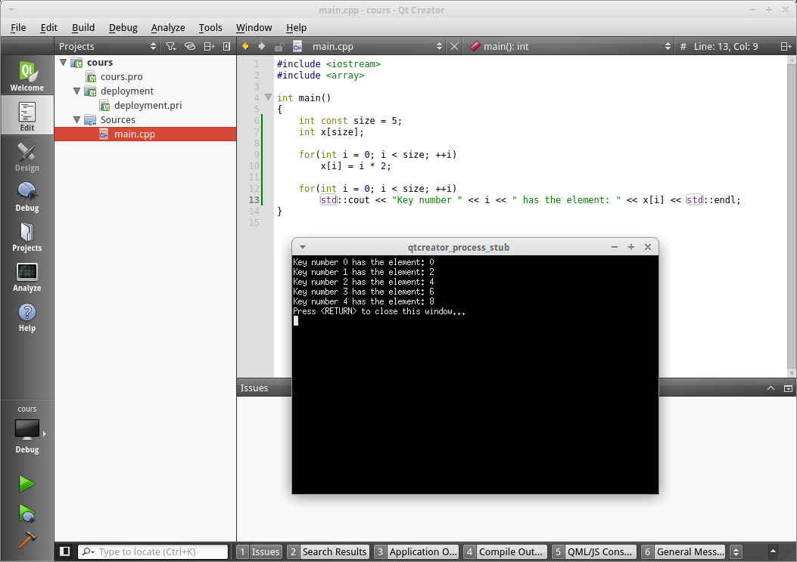

### Les tableaux statiques type C

En C++, il existe de nombreuses méthodes pour créer des tableaux, chaque méthode
ayant ses particularités. Nous allons étudier 3 méthodes ici et dans les
prochains chapitres, et nous découvrirons les autres prochainement.

Comme vous le savez, le C++ hérite du C. Tout ce qui existe en C existe aussi en
C++ ! Cela doit vous faire une belle jambe vu que vous ne connaissez pas le C.
Mais certaines notions du C sont tellement ancrés en C++ malgré tout qu'elles sont
encore utilisés. Ici nous allons étudier les tableaux statiques, héritage du C.

> **Info** Nombreuses sont les personnes qui utilisent encore ces tableaux, et
il n'est pas interdit de continuer à les utiliser. Nous verrons dans le
prochain chapitre l'équivalent en C++ des tableaux statiques.

Comme je vous l'ai dit, les tableaux servent à stocker plusieurs valeurs dans
une seule variable. Vous l'avez peut être remarqué, les variables que nous
avons étudié jusqu'ici ne contiennent qu'une valeur : un nombre ou une chaine
de caractère.

Ici nous allons découvrir comment stocker plusieurs nombres dans une seule
variable.

La particularité des tableaux statiques (contrairement aux tableaux dynamique)
est que leur taille est fixe. Si vous décidez d'y placer 42 éléments, le
tableau aura **toujours** 42 éléments.

#### L'opérateur ```[]```

Cet opérateur est l'élément clé qui va nous permettre d'utiliser et de créer des
tableaux. Pour rappel, la syntaxe de définition d'une variable classique est :

    TYPE NAME;
    
Désormais, pour créer un tableaux, la syntaxe sera :

    TYPE NAME[SIZE];
    
Où ```TYPE``` est le type des éléments contenu dans le tableau, ```NAME``` le
nom du tableau et ```SIZE``` la taille du tableau (le nombre d'éléments).

Notez les crochets qui entourent ```SIZE``` juste après le nom de la variable.
C'est le fameux opérateur ```[]```.

```SIZE``` est une variable et doit être une variable *constante*. C'est une
notion que nous n'avons pas encore vu, contentez vous de savoir qu'une
variable constante ne peut être modifié et se crée de cette manière :

    int const size = 8;
    int x[size];
    
```SIZE``` doit être constante car la taille du tableau est constante et que
cette variable nous sera utile encore plus tard.

> **Hint** Pour déclarer une variable constante, vous devez utiliser la syntaxe
suivante : ```TYPE const NAME;```.

#### L'initialisation !

Oui, comme une variable classique il ne faut pas oublier d'initialiser chaque
éléments de notre tableau, sinon votre application subira des comportements
indéfinis. Il existe deux méthodes pour initialiser notre tableau.

##### Avec la liste d'initialisation

C'est la méthode la plus simple mais la moins flexible, on peut utiliser la liste
d'initialisation. Voici un exemple :

    int const size = 3; // 3 éléments dans le tableau
    int tableau[size] = { 0, 1, 2 };
    
Une liste d'initialisation pour des valeurs (car il existe d'autres type de liste
d'initialisation) se construit de cette manière : on ouvre le ```{```, on insère
les valeurs séparés par une virgule puis on ferme le ```}```.

> **Note** Si vous voulez initialiser tout votre tableau à la valeur par défaut (```0``` pour
un nombre), il suffit de ne mettre aucune valeur dans la liste d'initialisation
(c'est à dire ```int tableau[size] = {};```).

##### En itérant le tableau

Vous vous souvenez de la boucle ```for``` ? Oui, cette boucle basé sur un système de
comptage ! Eh bien nous pouvons l'acceuillir à bras ouvert ici ! Elle est
parfaitement adapté pour itérer à travers le tableau.

Itérer est un nouveau terme qui signifie **parcourir un tableau** dans le cas présent.
Ici on va itérer un tableau d'entiers ```x``` qui contient ```size``` éléments afin de lui
assigner une valeur. Voici la procédure avec la boucle ```for``` qui devrai vous être
familière : 

    int const size = 5;
    int x[size];
    
    for(int i = 0; i < size; ++i)
        x[i] = i * 2;
        
    // On effectue des actions, des calculs...
    
    for(int i = 0; i < size; ++i)
        std::cout << "Key number " << i << " has the element: " << x[i] << std::endl;
        
Le principe est simple ici. On crée un tableau ```x``` de taille 5. Ensuite on
crée un compteur ```i``` qui est compris entre 0 et 5 exclus. Ce compteur ```i```
représente donc l'élément que nous sommes en train d'itérer. On accède à un élément
avec l'opérateur ```[]``` encore une fois en indiquant entre les crochets l'index
(le numéro) de l'élément que nous voulons.

Nous initialisons chacun des éléments du tableau à la valeur ```i * 2``` (0, 2, 4, 6, 8).
Après on peut imaginer qu'on fait des calculs, des choses sur le tableau et enfin on
affiche l'intégralité du tableau en itérant dessus. Vous devriez obtenir ceci :



Et c'est ici que nous pouvons remarquer un détail **très important**. Le numérotage
des éléments commence à **0** dans un tableau. Donc, si vous avez 10 éléments, ceux-ci
seront numérotés de 0 à 9. L'élément numéro 10 n'existera pas.

Vous ne devez jamais utiliser un tableau avec un index supérieur à sa taille car
votre application pourra (encore une fois) avoir des comportements indéfinis.

#### Accéder à un élément

Vous l'aurez compris, pour accéder à un élément dans le tableau il faut utiliser
l'opérateur ```[index]```. ```index``` peut être un nombre ou une variable représentant
un entier. ```index``` ne peut bien sur pas dépasser la taille du tableau ou être inférieur
à zéro.

Ainsi, voici plusieurs méthodes à suivre pour accéder à l'élément numéro 4 d'un tableau :

    int const size = 10;
    int x[size] = {};
    
    cout << x[4] << endl;
    cout << x[3 + 1] << endl;
    
    int three = 3;
    cout << x[three + 1] << endl;
    
Rien de bien compliqué, vous le voyez bien ! Maintenant, voyons ces même tableaux mais en version C++.