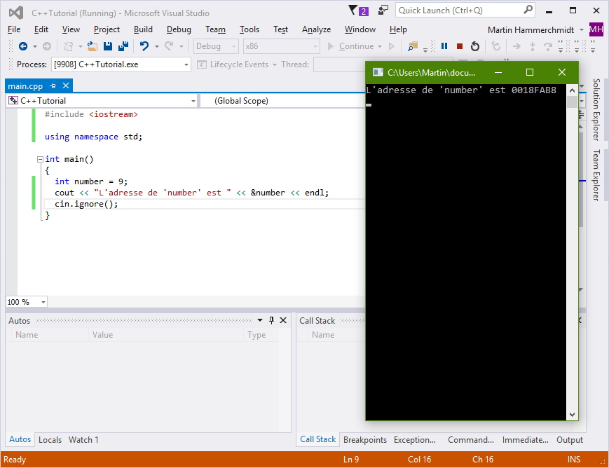
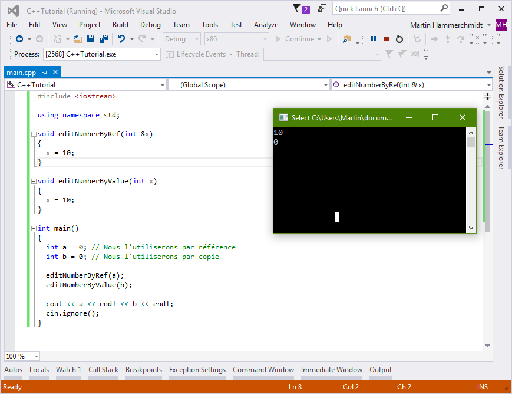

### Les références

#### Les adresse mémoires

Avant de pouvoir utiliser les références, il faut comprendre un principe très important. Chaque donnée qui est enregistré en mémoire vive a une adresse.

Cette adresse, sous la forme ```0xFFFFFF``` est généralement codé en hexadécimale et est un nombre entier.

Ainsi, lorsque vous utilisez ou créez une variable, votre logiciel réserve un espace dans la mémoire et y enregistre les données. Ensuite, il peut accéder à cet espace à n'importe quel moment grâce à l'adresse.

#### Obtenir et utiliser l'adresse en C++

Vous vous en doutez, nous pouvons obtenir et manipuler cette adresse en C++. Voici comment obtenir l'adresse d'une variable :

    int number = 9; // Nous créons la variable
    cout << "L'adresse de 'number' est " << &number << endl;
    
Comme vous le voyez, pour obtenir l'adresse mémoire d'une variable il faut la préfixer d'une esperluette, une ```&```. On appelle cela une référence.



D'autres manipulations avec les références :

    int number = 9;
    int &ref = number; // ref est une référence
    cout << "Number vaut " << ref << endl;
    
En fait, il faut vous imaginer qu'une référence en C++ est un autre accès à une variable. En gros, il y a les variables maitres et les variables esclaves. Une variable normale (et non une référence) est maitre. Elle crée la donnée originale. Une référence est "esclave", elle représente juste un autre accès à la même donnée. C'est un alias en quelque sorte.

Vous vous rappelez quand je vous ai expliqué comment créer et utiliser des fonctions ? Nous allons étudier ça plus en détails.

Prenez cet exemple :

    int add(int a, int b)
    {
      return a + b;
    }

    int main()
    {
      int a = 9;
      int b = 10;
      int c = add(a, b);
      
      // ...
    }
    
Dans cet exemple, nous utilisons une fonction qui ajoute deux nombre et retourne le résultat (c'est inutile certes, mais c'est pour l'exemple). Que ce passe t'il en interne ?

* Le logiciel crée deux variables a et b et leur assignent une valeur.
* Le logiciel crée la variable c.
* Le logiciel copie les variables a et b dans deux nouvelles variables temporaire : a' et b'.
* Le logiciel additionne a' et b' et le stocke dans une nouvelle variable temporaire c'.
* Le logiciel supprime a' et b'.
* Le logiciel assigne à c la valeur de c'.
* Le logiciel supprime c'.

Comme vous le voyez, le défaut est que le logiciel crée plusieurs variables inutiles ici. En effet, il crée des variables temporaire pour a et b, qui sont inutiles.

L'explication à ce phénomène est simple : lorsque vous appelez une fonction, tout argument passé à cette fonction est copié, systématiquement. On ne peut pas faire autrement.

Alors, si nous passons de grosses variables comme cela, le logiciel risque d'avoir des problèmes de performances car à chaque fois il doit copier la variable originale.

Ainsi, la solution est de passer une référence. En effet, si vous passez une référence, l'adresse mémoire originale est passée, et au lieu de copier les données, la fonction utilisera la donnée originale directement.

    int add(int &a, int &b)
    {
      return a + b;
    }
    
Et ici nous évitons alors la création de multiple variables inutiles. Quelle différence cela fait au niveau de la logique du code mis à par l'apparition d'une ```&``` dans la liste des paramètres de la fonction ?

Si vous modifiez les paramètres passés par référence, alors ce sera aussi modifié pour l'environnement d'appel de la fonction puisque les deux environnements (la fonction et l'appel de fonction) utilisent la même variable.

Si vous modifiez les paramètres passés par valeur (eg. par copie directe), alors rien ne se passera pour l'environnement d'appel. Voyez cet exemple :

    void editNumberByRef(int &x)
    {
      x = 10;
    }
    
    void editNumberByValue(int x)
    {
      x = 10;
    }
    
    int main()
    {
      int a = 0; // Nous l'utiliserons par référence
      int b = 0; // Nous l'utiliserons par copie
    
      editNumberByRef(a);
      editNumberByValue(b);
    
      cout << a << endl << b << endl;
      cin.ignore();
    }
    
Le résultat est :



Donc prenez bien garde à l'utilisation que vous faites de vos variables. Si vous les passez par copie, surveillez bien que la variable n'est pas trop grosse (un ```int``` par exemple c'est bon, un petit ```string``` aussi, mais un gros ```string```, préférez le passer par référence). Si vous passez une variable par référence, faites très attention quand vous la modifier.

Voilà, vous savez à peu près tout sur les références. Maintenant, entamons l'un des sujets les plus redoutés du C et du C++ ! Les pointeurs !