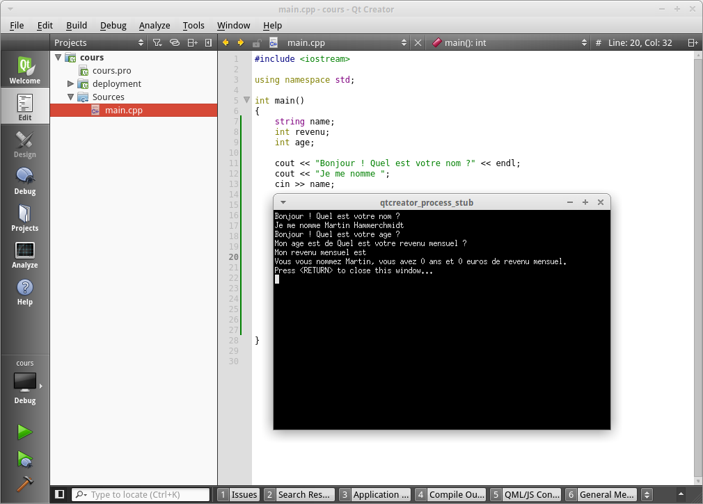

## Dialoguons avec l'utilisateur !

C'est bien beau de pouvoir afficher toute sorte de choses dans la console, mais
maintenant nous aimerions dialoguer avec l'utilisateur.

Par exemple, demandons son nom, demandons ce qu'il fait aujourd'hui, on peut
demander absolument tout ce que l'on souhaite !

> **Tag** Ce chapitre reste assez basique et ne traitera pas de l'intégralité de ce sujet.

Il existe deux méthodes pour réceptionner des informations depuis l'utilisateur
dans la console.

### La première méthode

Nous avons utilisé jusque ici le fameux ```cout``` (qui pour rappel se prononce 
*c-out* : Console OUT). Automatiquement par analogie nous allons découvrir le 
```cin``` (*c-in*, Console IN). Voici un exemple d'utilisation tout bête :

    #include <iostream>
    
    using namespace std;
    
    int main()
    {
        int revenu;
        
        cout << "Quel est votre revenu mensuel ?" << endl;
        cout << "Mon revenu mensuel est ";
        cin >> revenu;
        
        cout << endl << "Eh beh, " << revenu 
             << " euros, c'est un grand revenu !" << endl;
    }
    
Ici, deux découvertes. Alors oui, on peux décomposer un ```cout``` sur plusieurs
lignes comme je viens de le faire. 

> **Warning** N'oubliez pas, c'est le ```;``` qui délimite la fin d'une instruction (dans le cas présent c'est l'instruction ```cout```). Sauter une ligne ne délimitera jamais une instruction !

Ensuite, on peut voir le fameux ```cin```. Rien de plus simple vous le voyez,
il suffit d'écrire ```cin``` avec les chevrons dans le sens opposé de
```cout``` (car le flux va dans l'autre sens). Essayez ce programme chez vous,
rentrez un nombre lorsqu'il vous sera demandé et voyez la magie opérer !
Profitons en pour demander l'âge de l'utilisateur. Regardez plutôt :

    int revenu;
    int age;
    
    cout << "Bonjour ! Quel est votre age ?" << endl;
    cout << "Mon age est de ";
    cin >> age;


    cout << "Quel est votre revenu mensuel ?" << endl;
    cout << "Mon revenu mensuel est ";
    cin >> revenu;

    cout << endl << "Vous avez " << age << " ans et " << revenu << " euros de revenu mensuel."<< endl;
    
*Nous ne verrons pas les cas où l'utilisateur n'entre pas les valeurs voulues.*

Maintenant, demandons lui son nom et son prénom. Rien de plus simple à première 
vue, rajoutons des éléments à notre code :

    string name;
    int revenu;
    int age;

    cout << "Bonjour ! Quel est votre nom ?" << endl;
    cout << "Je me nomme ";
    cin >> name;

    cout << "Bonjour ! Quel est votre age ?" << endl;
    cout << "Mon age est de ";
    cin >> age;


    cout << "Quel est votre revenu mensuel ?" << endl;
    cout << "Mon revenu mensuel est ";
    cin >> revenu;

    cout << endl << "Vous vous nommez " << name
         << ", vous avez " << age
         << " ans et " << revenu << " euros de revenu mensuel."
         << endl;

Lancez le programme et entrez par exemple juste votre prénom. Tout fonctionne
parfaitement !


Mais que se passe-t-il si vous insérez votre prénom *et* votre nom ?



Le logiciel part en fanfare ! En effet il semble ne pas prendre en compte le
second mot que vous avez entrer et ignore complètement les autres ```cin```. La
raison à cela est simple : ```cin``` se limite à un mot par un mot. Et du coup,
comme il garde un mot un réserve (votre nom que vous avez mis après votre
prénom) il attend que vous lui demandiez de remplir un ```string``` pour vider
son *buffer* hors ce n'est pas ce que nous voulons.  Nous voulons récupérer
plusieurs mots et donc une ligne en quelque sorte.

### La seconde méthode

Fort heureusement, le C++ nous propose une fonction juste pour ça ! Je vous
présente ```getline```. Comme toujours, l'utilisation de cet outil reste
assez simple. En effet la syntaxe est ```getline(cin, VARIABLE);```. Ainsi,
voici notre exemple précédent corrigé :

    string name;
    int revenu;
    int age;

    cout << "Bonjour ! Quel est votre nom ?" << endl;
    cout << "Je me nomme ";
    getline(cin, name);


    cout << "Bonjour ! Quel est votre age ?" << endl;
    cout << "Mon age est de ";
    cin >> age;


    cout << "Quel est votre revenu mensuel ?" << endl;
    cout << "Mon revenu mensuel est ";
    cin >> revenu;

    cout << endl << "Vous vous nommez " << name
         << ", vous avez " << age
         << " ans et " << revenu << " euros de revenu mensuel."
         << endl;
         
Et hop ! Tout fonctionne correctement. Comme vous le voyez, ```getline``` met
automatiquement ce que l'utilisateur a entré dans la variable spécifié comme 
```cin``` .


Voilà. Ce chapitre reste vraiment basique car d'autres notions sont nécessaires
pour aller plus loin. Mais ne vous inquiétez pas, nous verrons tout au
fur et à mesure. Entamons maintenant les **conditions** !
