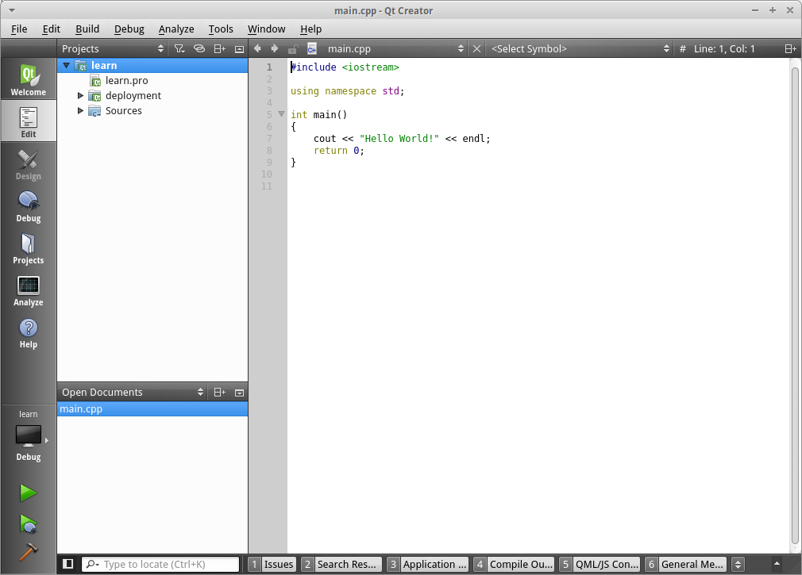
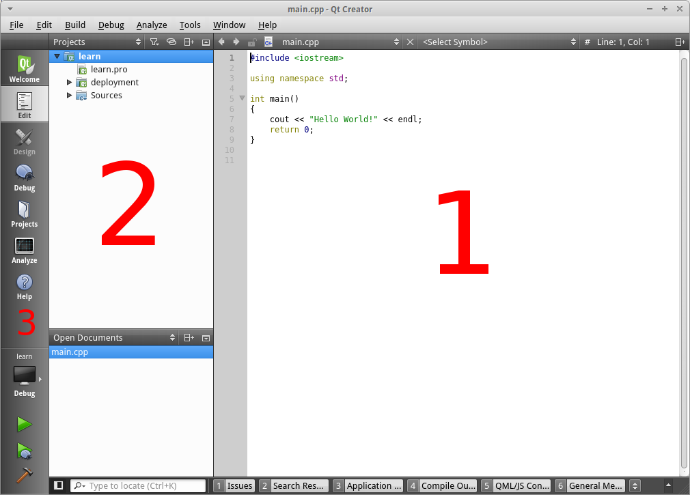

## Installons un IDE

### Un IDE ?

Ce terme signifie *Integrated Development Environment*. C'est un peu comme un
éditeur de texte avancé qui vous aidera lorsque vous programmerez. Par exemple
il complétera tout seul vos instructions ou corrigera vos erreurs.

Pour l'installer je vais directement vous proposer d'installer Qt, un outil
magique que nous utiliserons par la suite. Qt vous installera en même temps
le compilateur si vous êtes sur Windows et vous installera aussi Qt Creator : un
IDE.

### Comment installer Qt ?

Rien de plus simple. Non, vraiment !

Allez sur [cette page](http://www.qt.io/download-open-source/) et cliquez sur
le gros bouton vert. Un téléchargement se lancera, une fois qu'il sera fini
lancez le fichier obtenu puis laissez vous guider. Les paramètres par défaut
devraient être largement suffisant. Assurez vous tout de même que la case Tools
est cochée ainsi que la dernière version de Qt.

Ensuite l'installation commence, prenez un petit café ou un jus multi-vitaminé
le temps que celle-ci se termine !

### Sur linux

Notez que sur linux vous devez vous assuré d'avoir *build-essential* d'installé.
Ainsi sur les distributions utilisant Apt, voici la commande à utiliser :

    apt install build-essential

Adaptez la en fonction de votre distribution.

### Lançons Qt Creator !

Si vous êtes arrivé jusque ici, bravo ! Maintenant je vous propose de lancer
Qt Creator. Découvrons ce qu'il a dans le ventre et créons notre premier projet
C++.

Enfin le moment tant attendu ! Ladies and Gentlemans, je vous présente Qt 
Creator ! Et croyez moi, vous allez l'aimer. Ou tout du moins il vous facilitera
tellement la vie que vous ne pourrez plus vous en passer !

Peut être que votre version de Qt Creator sera différente de la mienne ou dans
une autre langue, cela importe peu les manipualtions seront probalement les
mêmes.

Cliquez sur *New Project* ou sur *Nouveau Projet* en français.

Une nouvelle fenêtre devrait apparaître. Allez dans les projets non Qt à gauche 
puis sélectionnez un projet C++ comme sur l'image. Enfin, validez. 
Nous n'utilisons pas Qt tout de suite, nous le découvrirons plus tard dans le 
livre.

Ensuite Qt Creator vous demandera un nom de projet, mettez par exemple *learn*
pour cet apprentissage. Cliquez sur suivant à plusieurs reprises, puis
le tant attendue éditeur apparaît enfin !

Nous pouvons découper Qt Creator en 3 parties :

La première partie contient le code. N'y faites pas encore attention nous
travaillerons dessus dans un prochain chapitre.

La seconde partie contient les fichiers ouverts et les fichiers de votre projet.
Pratique pour naviguer entre les différents fichiers !
Qt Creator découpe vos applications en projets. Chaque fichier *.pro*
représente un projet pour Qt Creator. Il contient la liste des fichiers,
la configuration, etc. Nous le découvrirons plus tard !

Enfin, la troisième partie contient différentes options pour configurer son
projet ou avoir de l'aide par exemple. Le plus important ici c'est les 4 boutons
en bas : le marteau sert à compiler votre projet, la flèche verte sert à
compiler votre projet *et* lancer votre application, tandis que la flèche verte
avec une coccinelle permet de lancer le projet en mode debuggage. Chose que nous
découvrirons plus tard aussi.