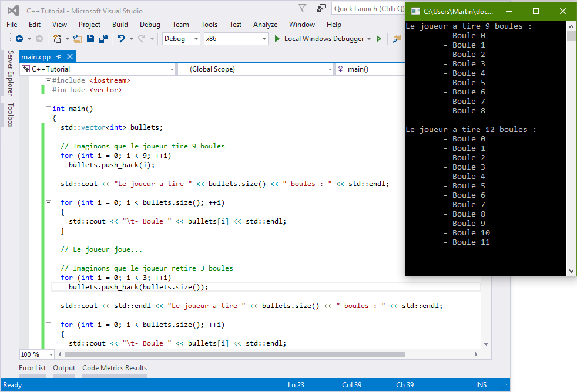

### Les tableaux dynamiques

#### La mise en bouche

Imaginez, vous êtes un développeur dans une jeune startup qui est en train de créer un jeu révolutionnaire. Dans ce jeu, vous contrôlez un personnage qui possède une seule et unique arme : un lanceur de boules.

Bien entendu, le joueur a la possibilité de tirer avec l'arme. Mais que ce passe t'il lorsque qu'il presse la détente ? Une boule est tirée. Bien entendu, chaque boule réagit à la physique et doit donc rester dans le monde virtuel.

Comment stocker les boules ? On ne peut pas utiliser un tableau statique car ceci ont une taille fixe hors notre joueur peut tirer autant de boules qu'il le souhaite. Il faut donc utiliser un tableau à taille variable. Ces tableaux sont des tableaux dynamiques.

Nous allons voir le tableau dynamique le plus simple, le ```vector```. Il en existe d'autres, que nous verront par la suite.

Le ```vector``` est très simple d'utilisation, voici un premier exemple déjà très complet :

    #include <iostream>
    #include <vector>

    int main()
    {
      std::vector<int> bullets; // La taille du tableau est 0
  
      // Imaginons que le joueur tire 9 boules
      for (int i = 0; i < 9; ++i)
        bullets.push_back(i);

      std::cout << "Le joueur a tire " << bullets.size() << " boules : " << std::endl;

      for (int i = 0; i < bullets.size(); ++i)
      {
        std::cout << "\t- Boule " << bullets[i] << std::endl;
      } // La taille du tableau est 9

      // Le joueur joue...

      // Imaginons que le joueur retire 3 boules
      for (int i = 0; i < 3; ++i)
        bullets.push_back(bullets.size());

      std::cout << std::endl << "Le joueur a tire " << bullets.size() << " boules : " << std::endl;

      for (int i = 0; i < bullets.size(); ++i)
      {
        std::cout << "\t- Boule " << bullets[i] << std::endl;
      } // La taille du tableau est 9 + 3 = 12
    }

Nous n'avons bien sur pas un jeu vidéo ici, mais c'est tout comme. Imaginez donc que le joueur joue et que à deux reprise il tire des boules. La première fois, il tire 9 boules, et la seconde fois il tire 3 boules.

Voici le résultat dans la console :


*Oui bon c'est vrai, j'ai changé d'OS et de logiciel. Mais chut :p*

J'en convient, il y a, ici, beaucoup de nouvelles choses. Mais ne vous inquiétez pas, rien d'insurmontable.

#### Et dans les détails ?

Premièrement, comme toujours, on inclus la fonction que l'on souhaite :

    #include <vector>
    
A partir de maintenant, je vais appeler le ```vector``` un vecteur.

La création et l'initialisation d'un vecteur est tout à fait similaire à un tableau statique en C++. Voici la syntaxe :

    vector<TYPE> NAME;
    
Contrairement à ce que nous avons vu jusqu'ici, pas besoin de spécifier de taille ! Et oui, ce tableau a une taille variable et est donc vide à la base il n'attend qu'à être rempli.

Entre les <>, vous devez insérer le type que contiendra le vecteur, et, pour rappel, il ne pourra enregistrer que ce type précis de données.

Voyons maintenant ce qu'il se passe dans le code étape par étape. Premièrement, on simule le joueur qui tire 9 boules. Pour ce faire ont fait une boucle comme nous avons vu dans un précédent chapitre, qui ajoute 9 boules dans le tableau. Ici, les boules sont en fait des ```int```, représentant le numéro de la boule.

Une fois fait, on fait le point dans la console et on affiche le nombre de boules puis on itère le tableau afin d'afficher le numéro de chacune des boules.

 > **Info** Le ```\t``` dans la chaîne de texte que nous affichons représente simplement une tabulation. En effet, lorsque la console affiche ce caractère, selon les paramètres du système, elle effectue une tabulation plus ou moins grande. C'est pratique pour hiérarchiser les informations.

La fonction ```size()``` permet d'obtenir sa taille. Utilisez la comme suit :

    int size = bullets.size();
    
Ainsi, ```size``` aura comme valeur le nombre d'éléments que contient le tableau.

#### Les fonctions push_back() et pop_back()

La fonction ```push_back()``` est le coeur même d'un vecteur. En effet, cette fonction permet d'ajouter un élément au tableau. Cet élément sera positionné à la dernière place, c'est à dire :

    int a = 5;
    int b = 10;
    
    vector<int> v;
    
    v.push_back(a);
    // a est à la position v.size() - 1, soit à la position 0
    
    v.push_back(b);
    // b est à la position v.size() - 1, soit à la position 1
    
Au contraire, la fonction ```pop_back()```, supprime le dernier élément.

#### La liste d'initialisation

Voici une autre syntaxe pour initialiser un vecteur :

    vector<int> v = { 1, 2, 3, 4, 5 };
    v.size(); // 5

Comme vous le voyez, on peut déclarer un vecteur puis l'initialiser avec des valeurs de manière assez élégante. La syntaxe est la suivante :

    vector<TYPE> NAME = { VALUES };
    
Vous savez déjà remplir ```TYPE``` et ```NAME```. L'ajout cette fois ci est ```VALUES```, où vous pouvez insérer toutes les valeurs que vous voulez, séparé par une ```,```.


### Les manipulations d'un vecteur

Un vecteur peut être manipulé de très nombreuses manières. Nous allons voir celles que nous avons pas déjà vu.

#### La fonction ```at()```

Il existe deux moyens d'accéder à un élément avec un vecteur. Vous pouvez soit utiliser l'opérateur ```[]```, de cette manière :

    std::vector<int> v = { 1, 2, 3, 4, 5 };
    std::cout << v[3] << std::endl;
    
Ce qui affichera ```4```. Mais que se passe t'il si le nombre que vous entrez entre les ```[]``` est trop grand ? Soit votre application plante, soit elle va avoir des comportements indéterminés.

Pour pallier ce problème, nous avons la fonction ```at()``` qui s'utilise comme suit :

    std::vector<int> v = { 1, 2, 3, 4, 5 };
    std::cout << v.at(3) << std::endl;
    
Cela affichera aussi ```4```. Vous devez mettre en paramètre (c'est à dire entre les parenthèses) le numéro de l'élément que vous souhaitez accéder. Si vous mettez un nombre trop grand ici, l'application ne plantera pas, une exception sera émise. Nous n'avons pas encore vu la gestion des exceptions donc contentez vous de retenir que les ```[]``` sont très dangereux si vous mettez un nombre trop grand alors que la fonction ```at()``` est sécurisée.

    