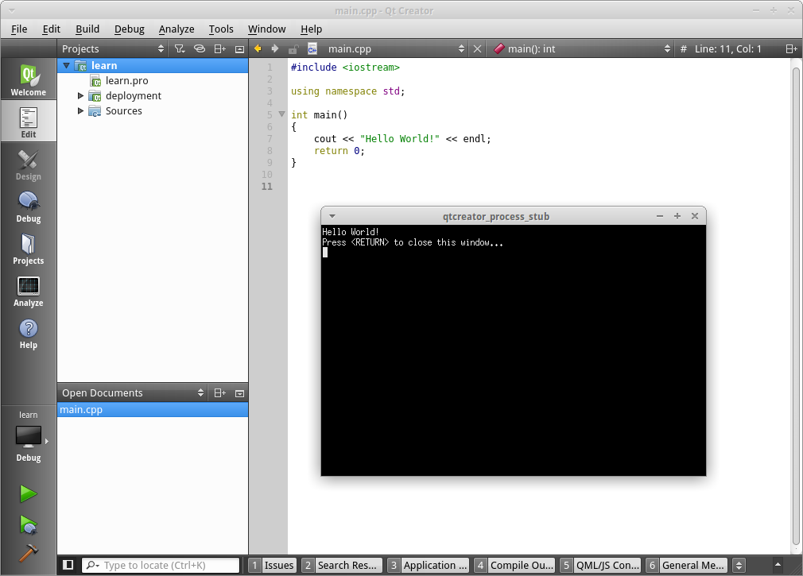

## Vos premières lignes de C++

Enfin nous entrons dans le coeur du sujet !

Normalement vous avez ce code-ci à l'écran (après avoir créé un nouveau projet)
:

    #include <iostream>
    
    using namespace std;
    
    int main()
    {
        cout << "Hello World!" << endl;
        return 0;
    }

Ce code vous parait peut être compliqué mais c'est en réalité le programme le
plus simple que l'on peux écrire en C++. Je vous laisse cliquer sur la flèche
verte, voici ce qui devrai apparaitre :



Et vous venez juste de lancer votre premier programme C++, **bravo !**

Maintenant je vous propose de remplacer le texte *Hello World!* par *Vive le
C++ !* et de relancer l'application avec la flèche verte. Voici ce qui devrai
apparaitre cette fois ci :


Nous en concluons donc que la syntaxe ```cout << "[UN TEXTE]" << endl;``` permet
d'afficher du texte à l'écran.

**Première règle :** à la fin de chaque instruction, vous devez mettre un point
virgule, qui marque la fin de cette instruction.